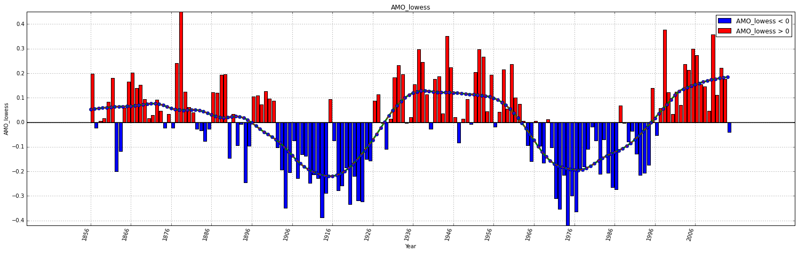

.. _AMO:

Atlantic Multidecadal Oscillation
=================================

-  Enable inline printing
~~~~~~~~~~~~~~~~~~~~~~~~~

.. code:: python

    %matplotlib inline
-  Import the cfData, cfPlot classes from the ecoop library
~~~~~~~~~~~~~~~~~~~~~~~~~~~~~~~~~~~~~~~~~~~~~~~~~~~~~~~~~~~

.. code:: python

    from ecoop.cf import cfData, cfPlot
.. code:: python

    cfd = cfData()
    cfp = cfPlot()
-  Retrieve the Atlantic Multidecadal Oscillation dataset
~~~~~~~~~~~~~~~~~~~~~~~~~~~~~~~~~~~~~~~~~~~~~~~~~~~~~~~~~

.. code:: python

    amodata = cfd.amo_get(prov=True)

.. parsed-literal::

    dataset used: http://www.cdc.noaa.gov/Correlation/amon.us.long.data

.. parsed-literal::

    'cell-output metadata saved'

-  Plot the Atlantic Multidecadal Oscillation dataset
~~~~~~~~~~~~~~~~~~~~~~~~~~~~~~~~~~~~~~~~~~~~~~~~~~~~~

.. code:: python

    # NAO
    cfp.plot_index(name='AMO_lowess', xticks=10, xticks_fontsize=10, 
                   data=amodata, nb='y', scategory='lowess', frac=1./6, it=6, 
                   dateformat=True)

.. parsed-literal::

    Session output file 'subplots.html' already exists, will be overwritten.

:ref:`build_PDF`.