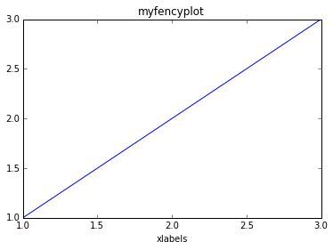

.. _build_pdf:

-  Import libraries
~~~~~~~~~~~~~~~~~~~

.. code:: python

    import os
    from ecoop.ecooputil import shareUtil
    from ecoop.printer import openDocument, closeDocument, addSection, addSubSection, addFigure
    from ecoop.epimagic import *
.. code:: python

    %matplotlib inline
.. code:: python

    util = shareUtil()
-  Start to write the latex Document
~~~~~~~~~~~~~~~~~~~~~~~~~~~~~~~~~~~~

.. code:: python

    ID = util.get_id('test/myfencypdf')
    document = openDocument()

.. parsed-literal::

    session data directory : test/myfencypdf_Saturday_26_April_2014_05_19_46_AM

-  Abstract
~~~~~~~~~~~

.. code:: python

    %%writefileref {ID}/abstract.txt epinux
    here is my little abstract, sorry it is really short ... but it is just a test to show you how easy is to use the IPython notebook with LaTex to build a nice PDF document.

.. parsed-literal::

    Writing test/myfencypdf_Saturday_26_April_2014_05_19_46_AM/abstract.txt

.. parsed-literal::

    'added references for user epinux'

.. code:: python

    abstract = addSection(name='Abstract', data=os.path.join(ID,'abstract.txt'))  
-  First paragraph
~~~~~~~~~~~~~~~~~~

.. code:: python

    %%writefileref {ID}/first_paragraph.txt epinux
    Here we are telling a story about our experience building a simple PDF document.
    The text inside this cell will go in the first paragraph (chapter?) of our PDF document.

.. parsed-literal::

    Writing test/myfencypdf_Saturday_26_April_2014_05_19_46_AM/first_paragraph.txt

.. parsed-literal::

    'added references for user epinux'

.. code:: python

    import numpy as np
    import matplotlib.pyplot as plt
    
    x = np.array([1,2,3])
    y = np.array([1,2,3])
    plt.plot(x,y,'-')
    plt.xlabel('xlabels')
    plt.title('myfencyplot')
    plt.show()
    plt.savefig(os.path.join(ID,'myfencyplot.png'))

.. parsed-literal::

    <matplotlib.figure.Figure at 0x7ffbeda42e10>

.. code:: python

    fig1 = addFigure(img=os.path.join(ID,'myfencyplot.png'), name='myfencyplot',metadata='')
.. code:: python

    firstparagraph  = addSubSection(name='First paragraph', data=os.path.join(ID,'first_paragraph.txt'), fig=fig1)
.. code:: python

    closedDocument = closeDocument()
-  Write Latex Document
~~~~~~~~~~~~~~~~~~~~~~~

.. code:: python

    texfile=''
    texfile += document
    texfile += abstract
    texfile += firstparagraph
    texfile += closedDocument
.. code:: python

    pdf = os.path.join(ID,'test.tex')
    f = open(pdf,'w')
    f.write(texfile)
    f.close()
-  Build PDF
~~~~~~~~~~~~

.. code:: python

    !pdflatex -output-directory={ID} {pdf}

.. parsed-literal::

    This is pdfTeX, Version 3.1415926-2.4-1.40.13 (TeX Live 2012/Debian)
     restricted \write18 enabled.
    entering extended mode
    (./test/myfencypdf_Saturday_26_April_2014_05_19_46_AM/test.tex
    LaTeX2e <2011/06/27>
    Babel <v3.8m> and hyphenation patterns for english, dumylang, nohyphenation, et
    hiopic, farsi, arabic, pinyin, croatian, bulgarian, ukrainian, russian, slovak,
     czech, danish, dutch, usenglishmax, ukenglish, finnish, french, basque, ngerma
    n, german, swissgerman, ngerman-x-2012-05-30, german-x-2012-05-30, monogreek, g
    reek, ibycus, ancientgreek, hungarian, bengali, tamil, hindi, telugu, gujarati,
     sanskrit, malayalam, kannada, assamese, marathi, oriya, panjabi, italian, lati
    n, latvian, lithuanian, mongolian, mongolianlmc, nynorsk, bokmal, indonesian, e
    speranto, coptic, welsh, irish, interlingua, serbian, serbianc, slovenian, friu
    lan, romansh, estonian, romanian, armenian, uppersorbian, turkish, afrikaans, i
    celandic, kurmanji, polish, portuguese, galician, catalan, spanish, swedish, th
    ai, loaded.
    (/usr/share/texlive/texmf-dist/tex/latex/base/article.cls
    Document Class: article 2007/10/19 v1.4h Standard LaTeX document class
    (/usr/share/texlive/texmf-dist/tex/latex/base/size10.clo))
    (/usr/share/texlive/texmf-dist/tex/latex/tools/multicol.sty)
    (/var/lib/texmf/tex/generic/babel/babel.sty
    (/usr/share/texlive/texmf-dist/tex/generic/babel/english.ldf
    (/usr/share/texlive/texmf-dist/tex/generic/babel/babel.def)))
    (/usr/share/texlive/texmf-dist/tex/latex/blindtext/blindtext.sty
    (/usr/share/texlive/texmf-dist/tex/latex/tools/xspace.sty))
    (/usr/share/texlive/texmf-dist/tex/latex/graphics/graphicx.sty
    (/usr/share/texlive/texmf-dist/tex/latex/graphics/keyval.sty)
    (/usr/share/texlive/texmf-dist/tex/latex/graphics/graphics.sty
    (/usr/share/texlive/texmf-dist/tex/latex/graphics/trig.sty)
    (/usr/share/texlive/texmf-dist/tex/latex/latexconfig/graphics.cfg)
    (/usr/share/texlive/texmf-dist/tex/latex/pdftex-def/pdftex.def
    (/usr/share/texlive/texmf-dist/tex/generic/oberdiek/infwarerr.sty)
    (/usr/share/texlive/texmf-dist/tex/generic/oberdiek/ltxcmds.sty))))
    (/usr/share/texlive/texmf-dist/tex/latex/wrapfig/wrapfig.sty)
    (/usr/share/texlive/texmf-dist/tex/latex/hyperref/hyperref.sty
    (/usr/share/texlive/texmf-dist/tex/generic/oberdiek/hobsub-hyperref.sty
    (/usr/share/texlive/texmf-dist/tex/generic/oberdiek/hobsub-generic.sty))
    (/usr/share/texlive/texmf-dist/tex/generic/ifxetex/ifxetex.sty)
    (/usr/share/texlive/texmf-dist/tex/latex/oberdiek/kvoptions.sty)
    (/usr/share/texlive/texmf-dist/tex/latex/hyperref/pd1enc.def)
    (/usr/share/texlive/texmf-dist/tex/latex/latexconfig/hyperref.cfg)
    (/usr/share/texlive/texmf-dist/tex/latex/url/url.sty))
    
    Package hyperref Message: Driver (autodetected): hpdftex.
    
    (/usr/share/texlive/texmf-dist/tex/latex/hyperref/hpdftex.def
    (/usr/share/texlive/texmf-dist/tex/latex/oberdiek/rerunfilecheck.sty))
    (/usr/share/texlive/texmf-dist/tex/latex/fancyvrb/fancyvrb.sty
    Style option: `fancyvrb' v2.7a, with DG/SPQR fixes, and firstline=lastline fix 
    <2008/02/07> (tvz)) (/usr/share/texlive/texmf-dist/tex/latex/base/inputenc.sty
    (/usr/share/texlive/texmf-dist/tex/latex/base/utf8.def
    (/usr/share/texlive/texmf-dist/tex/latex/base/t1enc.dfu)
    (/usr/share/texlive/texmf-dist/tex/latex/base/ot1enc.dfu)
    (/usr/share/texlive/texmf-dist/tex/latex/base/omsenc.dfu))) (./test.aux)
    (/usr/share/texlive/texmf-dist/tex/context/base/supp-pdf.mkii
    [Loading MPS to PDF converter (version 2006.09.02).]
    ) (/usr/share/texlive/texmf-dist/tex/latex/oberdiek/epstopdf-base.sty
    (/usr/share/texlive/texmf-dist/tex/latex/oberdiek/grfext.sty)
    (/usr/share/texlive/texmf-dist/tex/latex/latexconfig/epstopdf-sys.cfg))
    (/usr/share/texlive/texmf-dist/tex/latex/hyperref/nameref.sty
    (/usr/share/texlive/texmf-dist/tex/generic/oberdiek/gettitlestring.sty))
    (./test.out) (./test.out)
    (./test/myfencypdf_Saturday_26_April_2014_05_19_46_AM/abstract.txt)
    (./test/myfencypdf_Saturday_26_April_2014_05_19_46_AM/first_paragraph.txt)
    <test/myfencypdf_Saturday_26_April_2014_05_19_46_AM/myfencyplot.png, id=4, 433.
    62pt x 289.08pt>
    <use test/myfencypdf_Saturday_26_April_2014_05_19_46_AM/myfencyplot.png>
    Overfull \hbox (3.21652pt too wide) in paragraph at lines 19--20
    [][] 
    
    Package hyperref Warning: Empty destination name,
    (hyperref)                using `UNDEFINED' on input line 20.
    
    [1{/var/lib/texmf/fonts/map/pdftex/updmap/pdftex.map} <./test/myfencypdf_Saturd
    ay_26_April_2014_05_19_46_AM/myfencyplot.png>]
    (test/myfencypdf_Saturday_26_April_2014_05_19_46_AM/test.aux) )
    (see the transcript file for additional information)pdfTeX warning (dest): name
    {UNDEFINED} has been referenced but does not exist, replaced by a fixed one
    
    </usr/share/texlive/texmf-dist/fonts/type1/public/amsfonts/cm/cmbx12.pfb></usr/
    share/texlive/texmf-dist/fonts/type1/public/amsfonts/cm/cmr10.pfb>
    Output written on test/myfencypdf_Saturday_26_April_2014_05_19_46_AM/test.pdf (
    1 page, 29584 bytes).
    Transcript written on test/myfencypdf_Saturday_26_April_2014_05_19_46_AM/test.l
    og.

